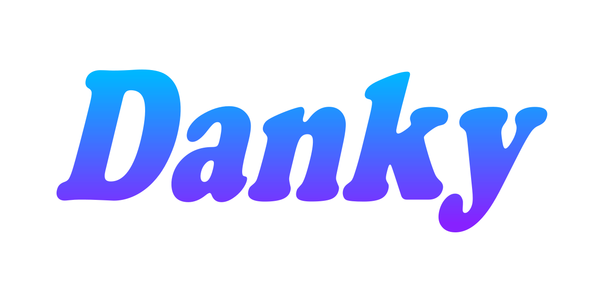

# Danky

> 🔔 Subscribe to the [newsletter](https://chv.to/chevere-newsletter) to don't miss any update regarding Chevere.


[](https://github.com/chevere/danky/actions)

[](LICENSE)
[](https://phpstan.org/)
[](https://dashboard.stryker-mutator.io/reports/github.com/chevere/danky/0.3)

[](https://sonarcloud.io/dashboard?id=chevere_danky)
[](https://sonarcloud.io/dashboard?id=chevere_danky)
[](https://sonarcloud.io/dashboard?id=chevere_danky)
[](https://sonarcloud.io/dashboard?id=chevere_danky)
[](https://sonarcloud.io/dashboard?id=chevere_danky)
[](https://sonarcloud.io/dashboard?id=chevere_danky)
[](https://www.codefactor.io/repository/github/chevere/danky)
[](https://www.codacy.com/gh/chevere/danky/dashboard)



## What is Danky?

Danky is a typed template system for PHP. Contrary to all other template systems, in Danky **templates are classes**.

🦄 Templates **explicit declare** its scope on construct, the `$render` property can be of type `string` or `Template`.

```php
<?php // Quote.php

use Chevere\Danky\Template;

class Quote extends Template
{
    public function __construct(string $text, string $author) {
        $this->render =
            <<<HTML
            <quote>"$text" --$author</quote>
            HTML;
    }
};
```

That `<<<HTML ...` is [Heredoc](https://www.php.net/manual/en/language.types.string.php#language.types.string.syntax.heredoc) syntax [string literal](https://www.php.net/manual/en/language.types.string.php). In Danky, you use all the stuff that _has been always there_ to handle multi-line string literals. Heredoc is great for templates as it evaluates variables, making templates clean to read.

```php
<?php // Home.php

use Chevere\Danky\Template;

class Home extends Template
{
    public function __construct(Template $content) {
        $this->render =
            <<<HTML
            <main>
                $content
            </main>
            HTML;
    }
};
```

`Template` classes implements `Stringable`, you can use any template object within string literals.

```php
<?php // index.php

use function Chevere\Danky\import;
use Home;
use Quote;

echo
    new Home(
        content: new Quote(
            text: 'Hello, world!',
            author: 'Rodolfo'
        )
    );
```

🥳 **Congratulations**! You just mastered Danky.

```html
<main>
    <quote>"Hello, world!"</quote>
</main>
```

Now run `php demo/index.php` for a more complete example.

## License

Copyright 2022 [Rodolfo Berrios A.](https://rodolfoberrios.com/)

Chevere is licensed under the Apache License, Version 2.0. See [LICENSE](LICENSE) for the full license text.

Unless required by applicable law or agreed to in writing, software distributed under the License is distributed on an "AS IS" BASIS, WITHOUT WARRANTIES OR CONDITIONS OF ANY KIND, either express or implied. See the License for the specific language governing permissions and limitations under the License.
